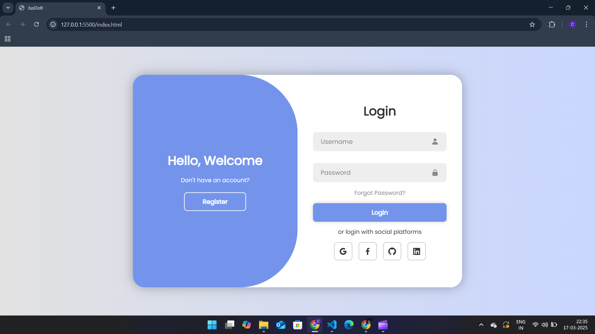

# 📌 User Authentication Form  
A responsive **Login & Registration Form** with email validation, password strength checking, and smooth UI animations.  


---

## 🚀 Features  
✅ Modern UI with login & registration toggle  
✅ Email & password validation  
✅ Password strength indicator  
✅ Social media login buttons  
✅ Mobile-responsive design  

---
### 💡 Login & Registration Page  


## 📂 Folder Structure  
user-auth-form
┣ 📜 index.html # Main structure of the authentication form
┣ 📜 style.css # Styling and animations
┗ 📜 script.js # Form validation and event handling

## ⚙️ Setup & Execution  
### 1️⃣ Clone the Repository  
```sh
git clone <your-repo-url>
cd user-auth-form
```
### 2️⃣ Open the Project
Simply open the index.html file in your browser.

### 3️⃣ Run a Local Server (Optional for Live Reload)
```sh
npx live-server
```
## Working
### **1️⃣ HTML (index.html)**
- The file contains a login and registration form.
- Users can enter their username, email, and password.
- Social media login buttons are included.
- A toggle panel switches between login and registration forms.
### **2️⃣ CSS (style.css)**
- Uses a modern gradient background.
- Form animations for a smooth transition between login and register views.
- Password validation indicators for better user experience.
- Responsive design to work on all screen sizes.
### **3️⃣ JavaScript (script.js)**
- Validates user input (email format, password strength, username length).
- Displays error messages for incorrect inputs.
- Toggles between login and register forms.
- Animates form elements for better UI experience.
